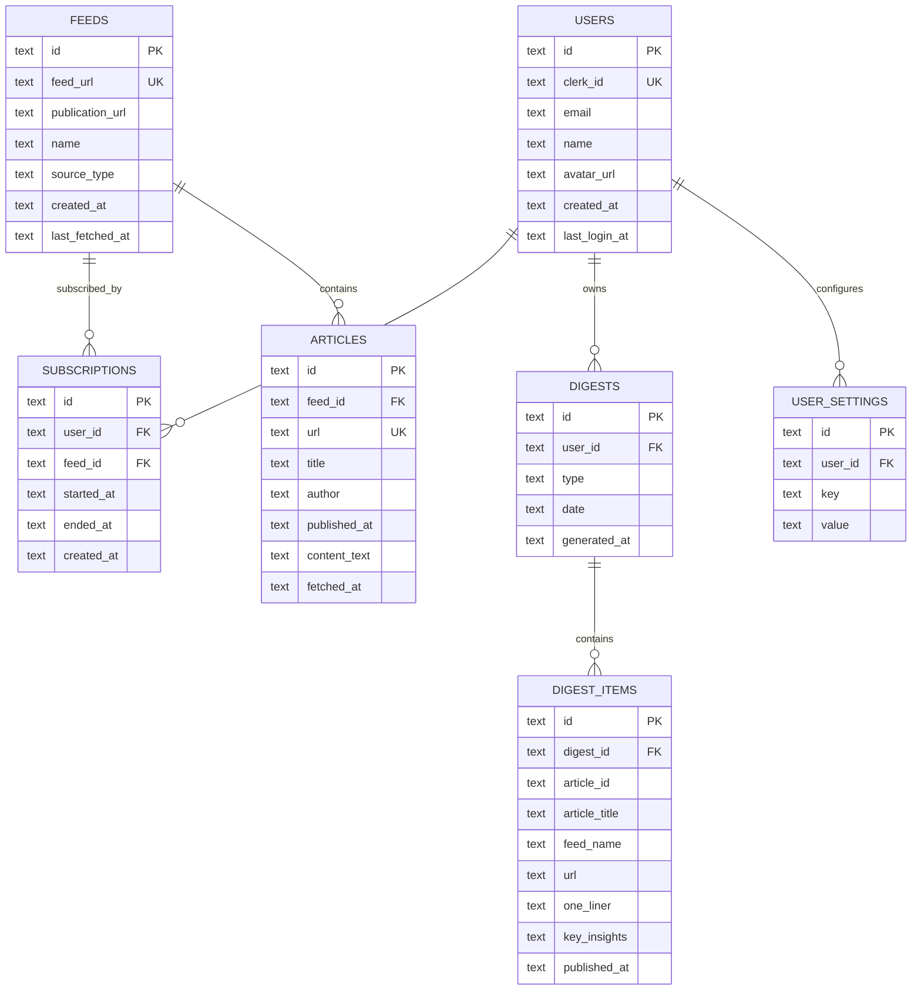
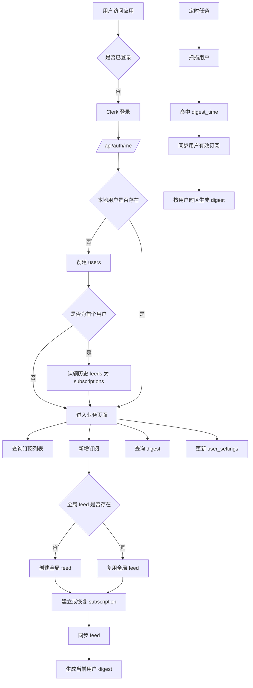

# DigestDesk 多用户架构

本文档收敛多用户系统的三类信息：

- 产品规则：系统应该如何工作
- 数据模型：这些规则如何映射到数据库结构
- API 链路：后端如何执行这些规则

## 1. 目标

- 使用 Clerk 管理身份认证
- 使用全局共享内容资产降低重复抓取和重复存储
- 使用用户私有订阅关系、日报快照和偏好设置实现多租户隔离
- 为后续订阅收费、审计、补算日报和功能扩展保留清晰边界

## 2. 正式业务规则

### 2.1 资产边界

- `feeds` 是全局共享资产
- `articles` 是全局共享资产
- `subscriptions` 是用户和全局 feed 之间的关系
- `digests` 是用户私有日报快照
- `user_settings` 是用户私有配置

补充说明：

- 系统维护的是全局事件流，原材料只有一份
- `feed` 和 `article` 是原材料，按全局唯一管理
- `digest` 不是原材料，而是按用户规则加工后的结果
- 同一篇 `article` 可以被多个用户的日报共同引用
- 但每个用户在同一天只能有一份自己的 `daily digest`

### 2.2 订阅生效规则

- 用户订阅一个 feed 后，从订阅生效时间开始接收内容
- 用户不能看到订阅生效前的历史日报
- 用户不能把订阅生效前发布的文章纳入自己的日报
- 同一天订阅时，是否进入当天日报，由 `subscription.started_at` 和文章发布时间比较决定

### 2.3 取消订阅与重新订阅

- 取消订阅只解除用户和 `feed` 的关系
- 不删除全局 `feed`
- 不删除全局 `articles`
- 已生成的历史 `digests` 保留
- 后续新日报不再纳入该 feed 的文章
- 取消订阅通过 `subscriptions.ended_at` 进行软删除

重新订阅采用方案 B：

- 视为一次新的订阅开始
- 重置 `subscription.started_at`
- 后续日报只纳入重新订阅之后的内容

### 2.4 日报规则

- 日报按用户自己的 `timezone` 切自然日
- 定时日报在 `D` 日的 `digestTime` 生成，但内容对应 `D-1` 的完整自然日
- `digestTime` 决定日报生成或投递时刻，不改变被总结内容所属日期
- 手动生成日报的本质是：
  - 同步该用户当前订阅的 feed
  - 复用全局 `articles`
  - 按该用户订阅关系和设置重算用户私有 digest 快照

补充说明：

- `digest.date` 表示被总结内容所属的日期
- `generated_at` 表示这份日报实际生成时间
- 晨间日报的成熟语义是“今天收到昨天的完整日报”

### 2.5 首个用户领取历史数据

- 这是迁移期规则，不是长期产品规则
- 首个登录用户自动认领系统已有 feed，建立订阅关系
- 认领的是“订阅关系”，不是直接继承旧日报
- 历史日报不直接归属给首个用户

## 3. 四层模型

当前正式模型分为四层：

- 全局层：`feeds`, `articles`
- 用户关系层：`subscriptions`
- 用户快照层：`digests`, `digest_items`
- 用户配置层：`user_settings`

### 3.1 `users`

作用：

- Clerk 用户在本地数据库中的业务映射

核心字段：

- `id`
- `clerk_id`
- `email`
- `name`
- `avatar_url`
- `created_at`
- `last_login_at`

### 3.2 `feeds`

作用：

- 全局订阅源目录

核心字段：

- `id`
- `feed_url`
- `publication_url`
- `name`
- `source_type`
- `created_at`
- `last_fetched_at`

语义：

- 一个 feed 全局只存一份
- 不属于某个用户

### 3.3 `articles`

作用：

- 全局抓取到的内容资产

核心字段：

- `id`
- `feed_id`
- `url`
- `title`
- `author`
- `published_at`
- `content_text`
- `fetched_at`

语义：

- 一篇文章全局只存一份
- 多个用户的 digest 可以共同引用

### 3.4 `subscriptions`

作用：

- 用户和 feed 的订阅关系

核心字段：

- `id`
- `user_id`
- `feed_id`
- `started_at`
- `ended_at`
- `created_at`

语义：

- `started_at` 决定订阅何时生效
- `ended_at` 为 `NULL` 表示当前有效订阅
- 重新订阅时，重置 `started_at`

### 3.5 `digests`

作用：

- 用户私有日报快照头信息

核心字段：

- `id`
- `user_id`
- `type`
- `date`
- `generated_at`

语义：

- 同一用户同一日期只应有一份相同类型日报
- `date` 表示被总结内容所属日期，不是生成日期
- 不同用户在同一日期可以各自拥有自己的日报
- 日报唯一性是 `(user_id, type, date)`，不是全局 `(type, date)`

### 3.6 `digest_items`

作用：

- 某份日报的条目明细

核心字段：

- `id`
- `digest_id`
- `article_id`
- `article_title`
- `feed_name`
- `url`
- `one_liner`
- `key_insights`
- `published_at`

语义：

- 保存的是日报生成时的结果快照
- 即使全局文章后续变化，历史日报仍保持稳定

### 3.7 `user_settings`

作用：

- 用户私有偏好配置

当前核心配置：

- `digest_time`
- `timezone`
- `digest_language`

## 4. ER 图

## 5. API 链路

### 5.1 认证入口

后端入口链路：

1. Express 全局挂载 `clerkMiddleware()`
2. 业务 API 使用 `requireAuth()`
3. `resolveUser` 将 Clerk `userId` 映射为本地数据库 `userId`
4. 后续业务查询统一按本地 `userId` 执行

### 5.2 登录到业务建档

- 用户通过 Clerk 登录
- 登录成功后，前端调用 `/api/auth/me`
- 如果本地用户不存在，则创建本地 `users` 记录
- 如果是迁移期首个用户：
  - 认领已有 `feeds`
  - 写入对应 `subscriptions`
  - 迁移旧单用户配置到 `user_settings`

### 5.3 订阅链路

查询订阅列表：

- `GET /api/feeds`
- `GET /api/rss-feeds`
- `GET /api/youtube-feeds`

执行方式：

- 查询当前用户 `subscriptions`
- 过滤 `ended_at IS NULL`
- 关联 `feeds`
- 返回该用户当前有效订阅源

新增订阅：

- `POST /api/feeds`
- `POST /api/rss-feeds`
- `POST /api/youtube-feeds`

执行方式：

1. 查全局 `feeds` 中是否已有同一个 `feed_url`
2. 如果没有：
   - 创建全局 `feed`
   - 创建当前用户 `subscription`
3. 如果已有：
   - 检查当前用户是否已有有效订阅
   - 如果已有有效订阅，返回重复错误
   - 如果有历史已取消订阅，恢复该关系并重置 `started_at`
   - 如果从未订阅过，创建新的 `subscription`
4. 后台触发 feed 同步
5. 按当前用户规则生成或更新日报

取消订阅：

- `DELETE /api/feeds/:id`
- `DELETE /api/feeds/batch`

执行方式：

- 不删除全局 `feed`
- 不删除全局 `article`
- 只更新当前用户对应 `subscription.ended_at`

### 5.4 设置链路

- `GET /api/settings`
- `POST /api/settings`

执行方式：

- 查询和写入当前用户的 `user_settings`
- 当前主要配置：
  - `digest_time`
  - `timezone`
  - `digest_language`

### 5.5 日报链路

查询日报：

- `GET /api/digests`
- `GET /api/digests/:id`

执行方式：

- `GET /api/digests` 按当前用户 `user_id` 查询 digest 列表
- `GET /api/digests/:id` 先校验 digest 归属，再读取对应 `digest_items`

手动生成日报：

- `POST /api/digests/generate`

执行方式：

1. 同步当前用户所有有效订阅的 feeds
2. 读取当前用户：
   - `timezone`
   - `digest_language`
3. 如果未显式传日期，则默认取该用户时区下的 `T-1`
4. 计算该用户时区下该日期的完整自然日时间窗口
5. 查询该用户有效订阅对应的文章
6. 再用 `subscription.started_at` 过滤掉订阅前文章
7. 对结果做 AI 总结
8. 写入或更新当前用户该日期的 digest 快照

### 5.6 定时任务链路

全局同步任务：

- 周期性扫描所有仍有有效订阅关系的 `feeds`
- 同步全局 `articles`

用户日报任务：

1. 扫描所有 `users`
2. 读取每个用户的：
   - `timezone`
   - `digest_time`
3. 如果当前时刻命中该用户的发送时间：
   - 同步该用户当前有效订阅的 feeds
   - 生成该用户时区下前一完整自然日的 digest

## 6. 查询边界与约束

所有读写操作都应遵守以下边界：

- 查询订阅列表：从 `subscriptions` 关联 `feeds`
- 查询日报列表：按 `digests.user_id`
- 查询日报内容：先校验 `digest.user_id`，再读取 `digest_items`
- 查询设置：按 `user_settings.user_id`
- 生成日报：按用户有效订阅的 feed，筛选 `published_at >= subscription.started_at`

推荐约束：

- `feeds.feed_url` 全局唯一
- `articles.url` 全局唯一
- `subscriptions(user_id, feed_id)` 对有效订阅唯一
- `digests(user_id, type, date)` 唯一
- `user_settings(user_id, key)` 唯一

这组约束对应的业务含义是：

- 同一个 feed 不重复建多份
- 同一篇文章不重复存多份
- 同一个用户同一天不重复生成多份相同 digest
- 不同用户可以基于同一批原材料各自生成自己的 digest

## 7. 核心流程图

## 8. 当前实现状态

截至当前版本，代码已基本切到以下方向：

- `feeds` 和 `articles` 作为全局资产
- `subscriptions` 作为用户订阅关系
- `digests` 作为用户私有日报
- `user_settings` 作为用户私有设置
- 旧单用户字段已从正式主模型中剥离

## 9. 后续优化项

当前实现是：

- 抓取任务独立周期运行，内容先入库
- 到 `digestTime` 时再执行日报聚合和摘要生成

这是一个可接受的早期实现。

后续更成熟的演进方向是：

- 抓取继续提前运行
- 摘要与 digest 预生成也提前完成
- 到 `digestTime` 时只做投递或展示

这样可以更稳定地逼近用户期望的送达时间，尤其适用于：

- 用户量增加
- 订阅源数量增加
- AI 总结耗时增加
- 最后一个抓取周期内新增内容较多
