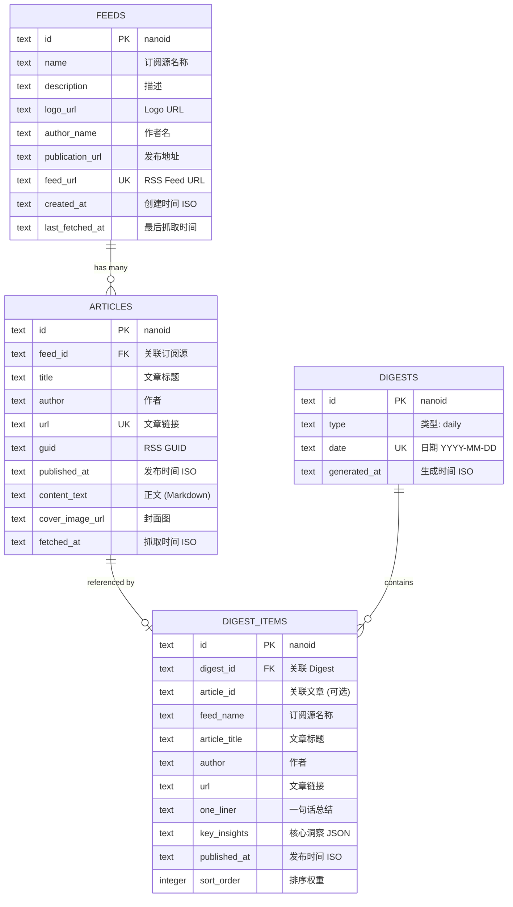
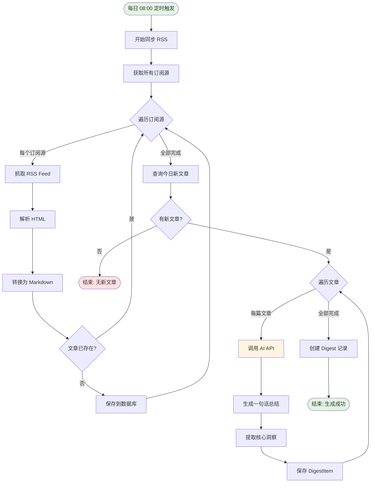
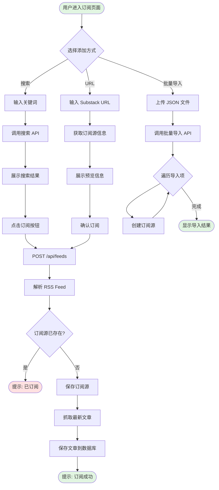
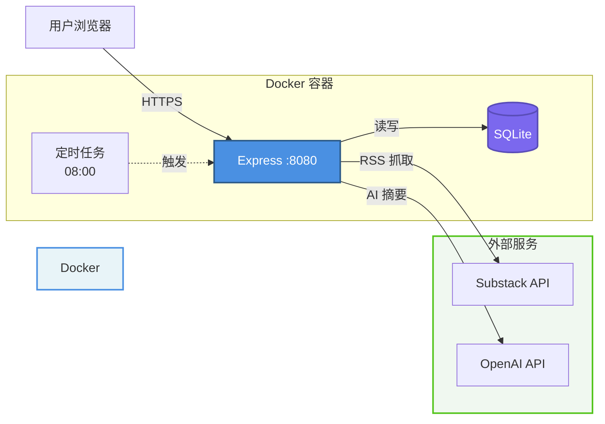

# DigestDesk 项目分析文档

> 个人编辑助手：自动阅读你订阅的 Substack，每天为你编辑一份专属 Digest

---

## 1. 项目概览表格

| 项目属性 | 详细信息 |
|---------|---------|
| 项目名称 | DigestDesk |
| 项目类型 | 全栈 Web 应用 (SPA + RESTful API) |
| 核心功能 | Substack 订阅管理 + AI 智能摘要 + 每日 Digest 生成 |
| 开发语言 | TypeScript (100%) |
| 架构模式 | Monorepo + 前后端分离 + 定时任务 |
| 数据库 | SQLite (文件数据库) |
| AI 能力 | OpenAI API / 兼容协议 (Kimi, DeepSeek, Zhipu) |
| 部署方式 | Docker 容器化部署 |
| 目标用户 | Substack 重度用户、信息管理者 |
| 开发状态 | 原型阶段 (v0.0.0) |

---

## 2. 技术栈版本表格

### 前端技术栈

| 技术 | 版本 | 用途 |
|------|------|------|
| React | 19.2.0 | UI 框架 |
| TypeScript | 5.9.3 | 类型系统 |
| Vite | 7.2.4 | 构建工具 |
| Wouter | 3.9.0 | 轻量级路由 |
| Tailwind CSS | 4.1.18 | 样式框架 |
| Radix UI | 1.x | 无障碍组件库 |
| Lucide React | 0.563.0 | 图标库 |
| date-fns | 4.1.0 | 日期处理 |
| Sonner | 2.0.7 | Toast 通知 |


### 后端技术栈

| 技术 | 版本 | 用途 |
|------|------|------|
| Node.js | - | 运行时环境 |
| Express | 5.1.0 | Web 框架 |
| TypeScript | 5.9.3 | 类型系统 |
| Better-SQLite3 | 11.9.1 | SQLite 驱动 |
| Drizzle ORM | 0.44.2 | ORM 框架 |
| Vercel AI SDK | 6.0.86 | AI 集成 |
| RSS Parser | 3.13.0 | RSS 解析 |
| Node-Cron | 4.0.7 | 定时任务 |
| Turndown | 7.2.2 | HTML 转 Markdown |
| Zod | 3.25.76 | 数据验证 |

### 开发工具

| 工具 | 版本 | 用途 |
|------|------|------|
| pnpm | - | 包管理器 (Monorepo) |
| ESLint | 9.39.1 | 代码检查 |
| Prettier | 3.8.1 | 代码格式化 |
| Vitest | 4.0.18 | 单元测试 |
| tsx | 4.19.4 | TypeScript 执行器 |
| Docker | - | 容器化部署 |

---

## 3. 项目文件结构树

```
DigestDesk/
├── src/                          # 前端源码
│   ├── components/               # React 组件
│   │   ├── ui/                   # Radix UI 基础组件
│   │   ├── AppShell.tsx          # 应用外壳 (导航/布局)
│   │   ├── ErrorBoundary.tsx     # 错误边界
│   │   └── ImportDialog.tsx      # 批量导入对话框
│   ├── contexts/                 # React Context
│   │   ├── ThemeContext.tsx      # 主题管理
│   │   └── ThemeTypes.ts         # 主题类型定义
│   ├── hooks/                    # 自定义 Hooks
│   │   ├── useTheme.tsx          # 主题切换
│   │   └── useZenMode.tsx        # 禅模式 (专注阅读)
│   ├── lib/                      # 工具库
│   │   ├── api.ts                # API 客户端
│   │   ├── types.ts              # 类型定义 (引用 shared)
│   │   └── utils.ts              # 工具函数
│   ├── pages/                    # 页面组件
│   │   ├── DailyDigest.tsx       # 每日摘要页
│   │   ├── Subscriptions.tsx     # 订阅管理页
│   │   └── NotFound.tsx          # 404 页面
│   ├── App.tsx                   # 应用入口
│   ├── main.tsx                  # React 挂载
│   └── index.css                 # 全局样式
│
├── server/                       # 后端源码
│   ├── src/
│   │   ├── db/                   # 数据库层
│   │   │   ├── schema.ts         # Drizzle Schema 定义
│   │   │   └── index.ts          # 数据库初始化
│   │   ├── routes/               # API 路由
│   │   │   ├── feeds.ts          # 订阅源管理
│   │   │   ├── digests.ts        # 摘要生成
│   │   │   └── substack.ts       # Substack 搜索/信息
│   │   ├── services/             # 业务逻辑层
│   │   │   ├── rss.ts            # RSS 抓取/同步
│   │   │   ├── digest.ts         # 摘要生成逻辑
│   │   │   ├── summarizer.ts     # AI 摘要服务
│   │   │   └── substack.ts       # Substack API 封装
│   │   ├── cron/                 # 定时任务
│   │   │   └── scheduler.ts      # 每日 08:00 自动生成
│   │   └── index.ts              # Express 服务器入口
│   ├── data/                     # SQLite 数据库文件
│   │   └── digestdesk.db         # 持久化数据
│   └── package.json              # 后端依赖
│
├── shared/                       # 前后端共享代码
│   └── types.ts                  # 共享类型定义
│
├── public/                       # 静态资源
├── dist/                         # 前端构建产物
├── docs/                         # 文档目录
├── scripts/                      # 构建脚本
│   └── babel-plugin-jsx-source-location.cjs
│
├── Dockerfile                    # Docker 镜像定义
├── DEPLOY.md                     # 部署指南
├── package.json                  # 根项目配置 (Monorepo)
├── pnpm-workspace.yaml           # pnpm Workspace 配置
├── vite.config.ts                # Vite 配置
├── tsconfig.json                 # TypeScript 配置
└── README.md                     # 项目说明
```

---

## 4. 数据模型 ER 图



### 数据关系说明

- **FEEDS → ARTICLES**: 一对多，级联删除
- **ARTICLES → DIGEST_ITEMS**: 一对一 (可选引用)
- **DIGESTS → DIGEST_ITEMS**: 一对多，级联删除
- **唯一约束**: `feed_url`, `article.url`, `digest.date`

---

## 5. 核心业务流程图

### 5.1 每日 Digest 自动生成流程



### 5.2 用户订阅 Substack 流程



---

## 6. API 模块接口功能表格

### 6.1 订阅源管理 (/api/feeds)

| 方法 | 路径 | 功能 | 请求参数 | 响应 |
|------|------|------|---------|------|
| GET | /api/feeds | 获取所有订阅源 | - | `Feed[]` |
| POST | /api/feeds | 创建订阅源 | `{ url: string }` | `Feed` |
| DELETE | /api/feeds/:id | 删除订阅源 | - | `void` |
| POST | /api/feeds/import | 批量导入订阅源 | `{ items: Array<{url, name?, ...}> }` | `{ created, skipped }` |
| DELETE | /api/feeds/batch | 批量删除订阅源 | `{ ids: string[] }` | `{ deleted: number }` |

### 6.2 摘要管理 (/api/digests)

| 方法 | 路径 | 功能 | 请求参数 | 响应 |
|------|------|------|---------|------|
| GET | /api/digests | 获取摘要列表 | `?type=daily` | `DigestListItem[]` |
| GET | /api/digests/:id | 获取摘要详情 | - | `Digest` (含 items) |
| POST | /api/digests/generate | 生成摘要 | `{ type, date?, force? }` | `{ id: string }` |

### 6.3 Substack 集成 (/api/substack)

| 方法 | 路径 | 功能 | 请求参数 | 响应 |
|------|------|------|---------|------|
| GET | /api/substack/search | 搜索 Substack | `?query=xxx` | `{ results: SubstackSearchResult[] }` |
| GET | /api/substack/info | 获取详细信息 | `?url=xxx` | `SubstackInfo` |
| GET | /api/substack/reads | 获取用户订阅列表 | `?username=xxx` | `{ results: SubstackSearchResult[] }` |

### 6.4 健康检查

| 方法 | 路径 | 功能 | 响应 |
|------|------|------|------|
| GET | /api/health | 健康检查 | `{ status: "ok", timestamp }` |

---

## 7. 前端特色功能表格

| 功能模块 | 技术实现 | 用户价值 | 亮点 |
|---------|---------|---------|------|
| **禅模式** | useZenMode Hook + Context | 专注阅读体验，隐藏导航栏 | 一键切换，沉浸式阅读 |
| **主题切换** | ThemeContext + CSS Variables | 明暗模式自由切换 | 保护视力，适应不同场景 |
| **响应式设计** | Tailwind CSS + Radix UI | 移动端/平板/桌面完美适配 | 无缝跨设备体验 |
| **实时搜索** | 防抖 + 请求 ID 去重 | 快速查找 Substack 订阅源 | 避免重复请求，性能优化 |
| **批量操作** | 多选模式 + 批量 API | 一键删除多个订阅源 | 提升管理效率 |
| **URL 预览** | 异步加载 + Skeleton | 添加前预览订阅源信息 | 避免误订阅，提升信心 |
| **进度提示** | 分阶段文案 + 动画 | 生成摘要时显示进度 | 降低等待焦虑 |
| **错误边界** | ErrorBoundary 组件 | 捕获 React 错误，优雅降级 | 提升稳定性 |
| **Toast 通知** | Sonner 库 | 操作反馈 (成功/失败) | 即时反馈，用户友好 |
| **日期本地化** | date-fns + zhCN | 中文日期格式化 | 符合中文用户习惯 |
| **锚点导航** | Hash 路由 + 平滑滚动 | 快速跳转到指定订阅源 | 提升长列表浏览效率 |
| **空状态设计** | 插画 + 引导文案 | 无数据时引导用户操作 | 降低学习成本 |

---

## 8. 部署架构图



**关键配置**

| 项目 | 配置 |
|------|------|
| 容器平台 | Zeabur / Railway / Fly.io |
| Volume 挂载 | `/app/server/data` (必须) |
| 环境变量 | `AI_API_KEY` (必填) |
| 端口 | 8080 |
| 健康检查 | `GET /api/health` |

### 部署要点

| 组件 | 配置要求 | 说明 |
|------|---------|------|
| **容器平台** | 支持 Docker + Volume | Zeabur / Railway / Fly.io |
| **Volume 挂载** | `/app/server/data` | 必须配置，否则数据丢失 |
| **环境变量** | `AI_API_KEY` (必填) | AI 服务密钥 |
| **端口** | 8080 | 容器内部端口 |
| **健康检查** | `GET /api/health` | 用于平台探针 |
| **构建命令** | `pnpm build:all` | 前后端一起构建 |
| **启动命令** | `node server/dist/index.js` | 生产环境启动 |

---

## 10. 工程亮点表格

| 亮点类别 | 具体实现 | 技术价值 | 业务价值 |
|---------|---------|---------|---------|
| **Monorepo 架构** | pnpm Workspace + 共享类型 | 代码复用，类型安全 | 降低维护成本 |
| **类型安全** | TypeScript 全栈 + Zod 验证 | 编译时错误检查 | 减少运行时 Bug |
| **ORM 抽象** | Drizzle ORM + Schema 定义 | 类型安全的数据库操作 | 提升开发效率 |
| **AI 集成** | Vercel AI SDK + 多厂商支持 | 统一接口，易于切换 | 降低 AI 成本 |
| **定时任务** | node-cron + 优雅错误处理 | 自动化内容同步 | 无需人工干预 |
| **并发控制** | p-limit 限流 | 避免 API 限流 | 提升稳定性 |
| **增量更新** | RSS GUID 去重 | 避免重复抓取 | 节省资源 |
| **级联删除** | Drizzle ORM 外键约束 | 数据一致性保证 | 避免脏数据 |
| **SPA Fallback** | Express 静态托管 + 路由回退 | 支持前端路由 | 用户体验流畅 |
| **健康检查** | 独立端点 + 快速响应 | 容器平台探针支持 | 提升部署成功率 |
| **延迟初始化** | 端口监听后再初始化 DB | 避免阻塞启动探针 | 通过平台健康检查 |
| **代理支持** | Cloudflare Worker 可选 | 绕过 Substack 限制 | 提升可用性 |
| **HTML 转换** | Turndown 库 | 统一内容格式 | 便于 AI 处理 |
| **错误边界** | React ErrorBoundary | 局部错误隔离 | 提升用户体验 |
| **无障碍设计** | Radix UI 组件库 | 键盘导航 + 屏幕阅读器 | 包容性设计 |
| **性能优化** | Vite 构建 + 代码分割 | 快速加载 | 降低跳出率 |
| **开发体验** | tsx watch + Vite HMR | 热更新 | 提升开发效率 |
| **容器化** | Dockerfile + 多阶段构建 | 一致的运行环境 | 简化部署流程 |

---

## 总结

DigestDesk 是一个技术栈现代、架构清晰的全栈应用，核心亮点包括：

1. **AI 驱动**: 利用 AI 自动生成高质量摘要，解决信息过载问题
2. **自动化**: 定时任务 + RSS 同步，无需人工干预
3. **类型安全**: TypeScript 全栈 + Drizzle ORM，减少运行时错误
4. **用户体验**: 响应式设计 + 禅模式 + 主题切换，关注细节
5. **易部署**: Docker 容器化 + 详细文档，降低部署门槛

适合作为 Substack 重度用户的个人工具，也可作为全栈项目学习参考。
