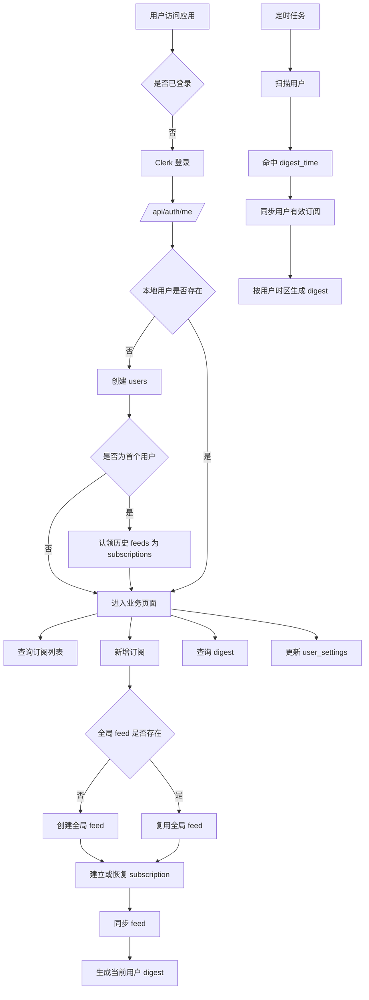

# DigestDesk API 链路

本文档从后端请求执行角度说明 DigestDesk 多用户系统如何运行。

相关文档：

- [产品规则](/Volumes/Sheng/AIcases/digestdesk/docs/product-rules.md)
- [数据模型](/Volumes/Sheng/AIcases/digestdesk/docs/data-model.md)

## 1. 认证入口

后端入口链路：

1. Express 全局挂载 `clerkMiddleware()`
2. 业务 API 使用 `requireAuth()`
3. `resolveUser` 将 Clerk `userId` 映射为本地数据库 `userId`
4. 后续业务查询统一按本地 `userId` 执行

## 2. 登录到业务建档

### 2.1 前端入口

- 用户通过 Clerk 登录
- 登录成功后，前端调用 `/api/auth/me`
- 如果本地用户不存在，则创建本地 `users` 记录

### 2.2 `/api/auth/me`

作用：

- 查找本地 `users`
- 如不存在，则根据 Clerk 用户信息创建
- 如果是迁移期首个用户：
  - 认领已有 `feeds`
  - 写入对应 `subscriptions`
  - 迁移旧单用户配置到 `user_settings`

## 3. 订阅链路

### 3.1 查询订阅列表

接口：

- `GET /api/feeds`
- `GET /api/rss-feeds`
- `GET /api/youtube-feeds`

执行方式：

- 查询当前用户 `subscriptions`
- 过滤 `ended_at IS NULL`
- 关联 `feeds`
- 返回该用户当前有效订阅源

### 3.2 新增订阅

接口：

- `POST /api/feeds`
- `POST /api/rss-feeds`
- `POST /api/youtube-feeds`

执行方式：

1. 查全局 `feeds` 中是否已有同一个 `feed_url`
2. 如果没有：
   - 创建全局 `feed`
   - 创建当前用户 `subscription`
3. 如果已有：
   - 检查当前用户是否已有有效订阅
   - 如果已有有效订阅，返回重复错误
   - 如果有历史已取消订阅，恢复该关系并重置 `started_at`
   - 如果从未订阅过，创建新的 `subscription`
4. 后台触发 feed 同步
5. 按当前用户规则生成或更新日报

### 3.3 取消订阅

接口：

- `DELETE /api/feeds/:id`
- `DELETE /api/feeds/batch`

执行方式：

- 不删除全局 `feed`
- 不删除全局 `article`
- 只更新当前用户对应 `subscription.ended_at`

### 3.4 重新订阅

执行方式：

- 找到历史订阅关系
- 将 `ended_at` 置空
- 重置 `started_at`

这表示一次新的订阅开始。

## 4. 设置链路

接口：

- `GET /api/settings`
- `POST /api/settings`

执行方式：

- 查询和写入当前用户的 `user_settings`
- 当前主要配置：
  - `digest_time`
  - `timezone`
  - `digest_language`

## 5. 日报链路

### 5.1 查询日报

接口：

- `GET /api/digests`
- `GET /api/digests/:id`

执行方式：

- `GET /api/digests` 按当前用户 `user_id` 查询 digest 列表
- `GET /api/digests/:id` 先校验 digest 归属，再读取对应 `digest_items`

### 5.2 手动生成日报

接口：

- `POST /api/digests/generate`

执行方式：

1. 同步当前用户所有有效订阅的 feeds
2. 读取当前用户：
   - `timezone`
   - `digest_language`
3. 如果未显式传日期，则默认取该用户时区下的 `T-1`
4. 计算该用户时区下该日期的完整自然日时间窗口
5. 查询该用户有效订阅对应的文章
6. 再用 `subscription.started_at` 过滤掉订阅前文章
7. 对结果做 AI 总结
8. 写入或更新当前用户该日期的 digest 快照

## 6. 定时任务链路

### 6.1 全局同步任务

执行方式：

- 周期性扫描所有仍有有效订阅关系的 `feeds`
- 同步全局 `articles`

### 6.2 用户日报任务

执行方式：

1. 扫描所有 `users`
2. 读取每个用户的：
   - `timezone`
   - `digest_time`
3. 如果当前时刻命中该用户的发送时间：
   - 同步该用户当前有效订阅的 feeds
   - 生成该用户时区下前一完整自然日的 digest

## 7. 核心流程图

