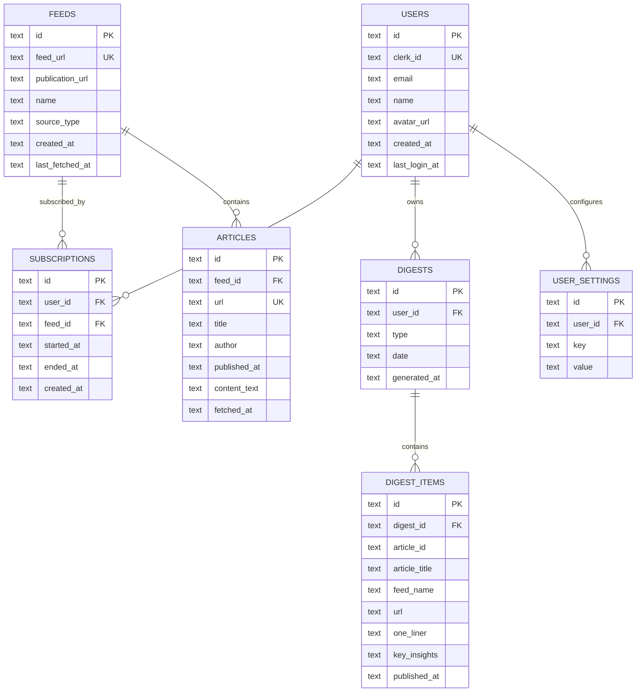

# DigestDesk 数据模型

本文档从数据结构角度解释 DigestDesk 多用户系统如何落地产品规则。

相关文档：

- [产品规则](/Volumes/Sheng/AIcases/digestdesk/docs/product-rules.md)
- [API 链路](/Volumes/Sheng/AIcases/digestdesk/docs/api-flow.md)

## 1. 模型概览

当前正式模型分为四层：

- 全局层：`feeds`, `articles`
- 用户关系层：`subscriptions`
- 用户快照层：`digests`, `digest_items`
- 用户配置层：`user_settings`

## 2. 表职责

### 2.1 `users`

作用：

- Clerk 用户在本地数据库中的业务映射

核心字段：

- `id`
- `clerk_id`
- `email`
- `name`
- `avatar_url`
- `created_at`
- `last_login_at`

### 2.2 `feeds`

作用：

- 全局订阅源目录

核心字段：

- `id`
- `feed_url`
- `publication_url`
- `name`
- `source_type`
- `created_at`
- `last_fetched_at`

语义：

- 一个 feed 全局只存一份
- 不属于某个用户

### 2.3 `articles`

作用：

- 全局抓取到的内容资产

核心字段：

- `id`
- `feed_id`
- `url`
- `title`
- `author`
- `published_at`
- `content_text`
- `fetched_at`

语义：

- 一篇文章全局只存一份
- 多个用户的 digest 可以共同引用

### 2.4 `subscriptions`

作用：

- 用户和 feed 的订阅关系

核心字段：

- `id`
- `user_id`
- `feed_id`
- `started_at`
- `ended_at`
- `created_at`

语义：

- `started_at` 决定订阅何时生效
- `ended_at` 为 `NULL` 表示当前有效订阅
- 重新订阅时，重置 `started_at`

### 2.5 `digests`

作用：

- 用户私有日报快照头信息

核心字段：

- `id`
- `user_id`
- `type`
- `date`
- `generated_at`

语义：

- 同一用户同一日期只应有一份相同类型日报
- `date` 表示被总结内容所属日期，不是生成日期

### 2.6 `digest_items`

作用：

- 某份日报的条目明细

核心字段：

- `id`
- `digest_id`
- `article_id`
- `article_title`
- `feed_name`
- `url`
- `one_liner`
- `key_insights`
- `published_at`

语义：

- 保存的是日报生成时的结果快照
- 即使全局文章后续变化，历史日报仍保持稳定

### 2.7 `user_settings`

作用：

- 用户私有偏好配置

当前核心配置：

- `digest_time`
- `timezone`
- `digest_language`

## 3. ER 图

## 4. 查询边界

所有读写操作都应遵守以下边界：

- 查询订阅列表：从 `subscriptions` 关联 `feeds`
- 查询日报列表：按 `digests.user_id`
- 查询日报内容：先校验 `digest.user_id`，再读取 `digest_items`
- 查询设置：按 `user_settings.user_id`
- 生成日报：按用户有效订阅的 feed，筛选 `published_at >= subscription.started_at`

## 5. 推荐约束

- `feeds.feed_url` 全局唯一
- `articles.url` 全局唯一
- `subscriptions(user_id, feed_id)` 对有效订阅唯一
- `digests(user_id, type, date)` 唯一
- `user_settings(user_id, key)` 唯一

## 6. 当前实现状态

截至当前版本，代码已基本切到以下方向：

- `feeds` 和 `articles` 作为全局资产
- `subscriptions` 作为用户订阅关系
- `digests` 作为用户私有日报
- `user_settings` 作为用户私有设置
- 旧单用户字段已从正式主模型中剥离
